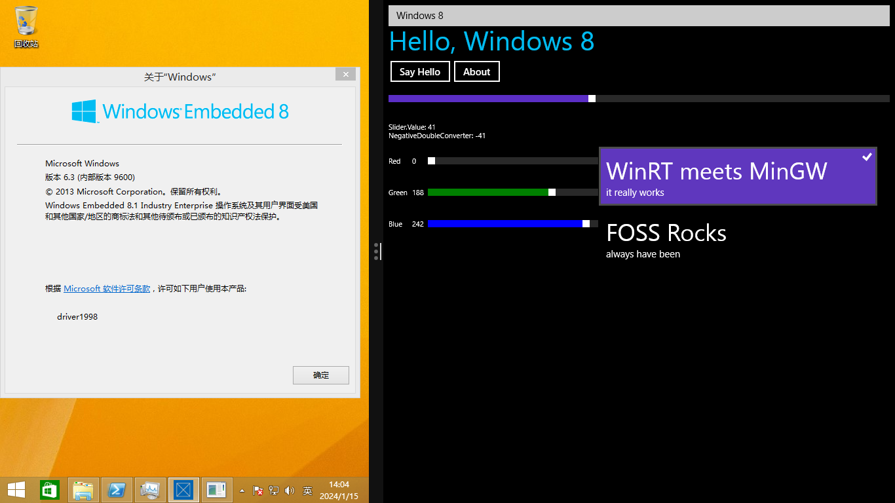

# MinGW UWP Demo

This is a demo of UWP apps (CoreApplication) on MinGW.



## Why

To stress test the new C++/WinRT MinGW support mostly, also it is fun.

## Build

To build this, you'll need the following:

- CMake
- C++/WinRT `cppwinrt` in `$PATH`
- A MinGW toolchain, LLVM/Clang 15 and GCC 12 from MSYS2 are tested. llvm-mingw is also tested.

The best way to get a working toolchain is install the following in MSYS2:

```
# CLANG64 Subsystem, with LLVM/Clang
pacman -S mingw-w64-clang-x86_64-{toolchain,cppwinrt,cmake,ninja}

# UCRT64 Subsystem, with GCC
pacman -S mingw-w64-ucrt-x86_64-{toolchain,cppwinrt,cmake,ninja}
```

With these, just build using CMake:
```
cd src/build
cmake ..
cmake --build .
```

## Deploy

Manual deploy is required for now, you can use the `Add-AppxPackage` PowerShell cmdlet for this.

If you are currently in MSYS2 bash, you can deploy and run the app with: 

```
powershell.exe -Command Add-AppxPackage -Register ./AppxManifest.xml
explorer.exe '/e,shell:appsfolder\CoreAppMinGW_706gaab1xw0ht!App'
```

Non-desktop devices (Xbox, Mobile, IoT Core, etc) are not tested.

## Packaging

You can create an Appx with the `appx` target:

```
cmake --build . -t appx
```

`makemsix` from [msix-packaging](https://github.com/microsoft/msix-packaging) is required in `$PATH`.

The package is not signed by default.

Signing the package requires osslsigncode version 2.9 or higher due to a bug in msix/appx handling.
Alternatively, you can use `MakeAppx.exe` and `SignTool.exe` from Windows SDK.

## What works

- XAML layout (load in **runtime** only)
- `IValueConverter` (initialized in code-behind)
- Data binding with `ICustomPropertyProvider` (see `MainWindowViewModel.cpp` and `Property.hpp` on how to implement this, it sucks but eh)
- `ICommand`
- Setting events from code-behind

## What doesn't

- Compiled XAML and `x:Bind`
- Automatically generated control references via `x:Name` (so you'll need to crawl through the logical tree to get to your controls)
- Anything else? Feel free to hack around
